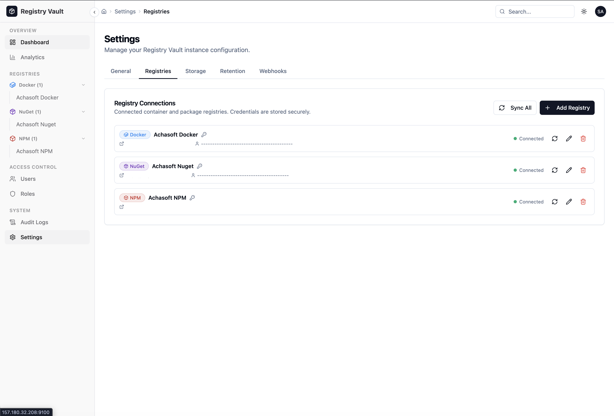
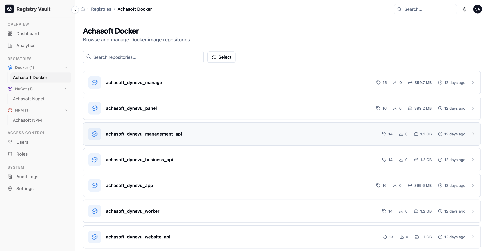
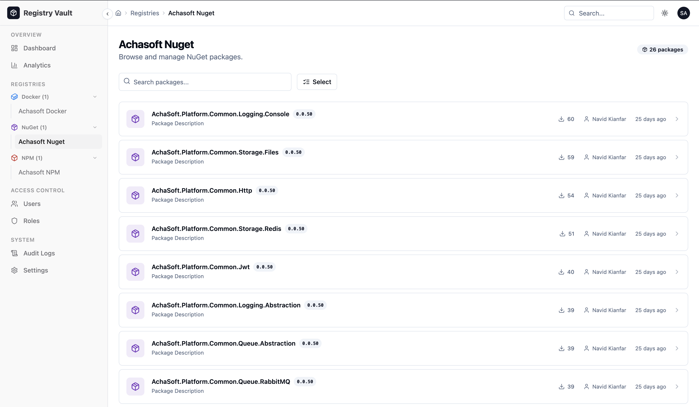

<p align="center">
  
</p>

<h1 align="center">Registry Vault</h1>

<p align="center">
  A self-hosted management panel for private Docker, NuGet, and NPM registries.<br />
  Browse, manage, and clean up images and packages from a single unified UI.
</p>

<p align="center">
  
  
  
  
  
</p>

---
Repository manager:


Docker images:


Nuget packages:


more screenshots are available in screenshots folder

## Overview

Registry Vault connects to your existing private registries and gives you a clean UI to:

- **Browse** Docker repositories, image tags, NuGet packages, and NPM modules
- **Delete** individual images/versions or bulk-clean by age or count
- **Monitor** storage usage, registry health, and pull/push activity
- **Manage** users, teams, roles, and access permissions
- **Automate** cleanup via retention policies with manual or scheduled runs
- **Audit** every action with a filterable, timestamped audit log

> Registry Vault manages and removes artifacts — it does **not** push to registries.

---

## Tech Stack

| Layer | Technology |
|-------|-----------|
| **API** | NestJS 10 + TypeORM (SQLite by default) |
| **Frontend** | React 19 + TypeScript 5.7 + Vite 6 (SWC) |
| **Styling** | Tailwind CSS 3.4 + shadcn/ui (Radix UI) |
| **State / Data** | TanStack React Query v5 |
| **Routing** | React Router v7 |
| **Charts** | Recharts 2.x |
| **Auth** | JWT (Bearer token, stored in localStorage) |
| **PWA** | vite-plugin-pwa — offline support + auto-update banner |
| **Monorepo** | pnpm workspaces |

---

## Project Structure

```
repo-station/
├── apps/
│   ├── api/                    # NestJS backend
│   │   └── src/
│   │       ├── auth/           # JWT login/logout, current user
│   │       ├── dashboard/      # Stats and activity feed
│   │       ├── docker/         # Docker repository and tag management
│   │       ├── nuget/          # NuGet package management
│   │       ├── npm/            # NPM package management
│   │       ├── rbac/           # Users, teams, roles
│   │       ├── audit-logs/     # Audit log records
│   │       ├── analytics/      # Pull/push trend data
│   │       ├── bulk/           # Bulk delete and cleanup operations
│   │       └── settings/       # Connections, credentials, policies, webhooks
│   └── web/                    # React/Vite frontend (PWA)
│       └── src/
│           ├── components/
│           │   ├── ui/         # shadcn/ui primitives
│           │   ├── layout/     # AppLayout, Sidebar, Topbar, Breadcrumbs
│           │   └── shared/     # StatCard, RegistryBadge, EmptyState, etc.
│           ├── features/
│           │   ├── dashboard/
│           │   ├── docker/
│           │   ├── nuget/
│           │   ├── npm/
│           │   ├── rbac/
│           │   ├── audit-logs/
│           │   ├── analytics/
│           │   └── settings/
│           ├── services/
│           │   ├── api-client.ts       # IApiClient interface
│           │   ├── http-api-client.ts  # Fetch-based implementation
│           │   └── queries/            # React Query hooks per feature
│           └── providers/              # Auth, Theme, Sidebar, QueryClient
└── packages/
    └── shared/                 # @registry-vault/shared (types shared by API + Web)
        └── src/
            ├── enums/          # RegistryType, Role, Permission, AuditAction, …
            ├── interfaces/     # All data models
            ├── types/          # ApiResponse<T>, PaginatedResponse<T>, filters
            └── constants/      # Registry labels, pagination defaults
```

---

## Getting Started

### Prerequisites

- **Node.js** >= 20
- **pnpm** >= 9

### Development

```bash
# Clone
git clone <repo-url>
cd repo-station

# Install dependencies
pnpm install

# Start API (port 3001) and frontend (port 3000) concurrently
pnpm dev
```

- Frontend: `http://localhost:3000`
- API: `http://localhost:3001`

The frontend proxies `/api/*` requests to the API during development.

### Default credentials

On first run the API seeds an admin user:

| Username | Password |
|----------|----------|
| `admin` | `admin123` |

### Build for Production

```bash
pnpm build
```

Frontend output: `apps/web/dist/`
API output: `apps/api/dist/`

### Docker

#### Using Docker Compose (Recommended)

The easiest way to run Registry Vault is with Docker Compose:

```bash
docker compose up -d
```

This will use the `docker-compose.yml` file, which sets up persistence for your database in the `./data` directory and uses the `.env` file for configuration.

#### Using Docker Image directly

You can run Registry Vault using the pre-built Docker image:

```bash
docker pull kianfar/registry-vault
docker run --env-file .env -p 80:80 kianfar/registry-vault
```

#### Build locally

If you prefer to build the image yourself:

```bash
docker build -t registry-vault .
docker run --env-file .env -p 80:80 registry-vault
```

The container exposes port **80** and listens on `0.0.0.0`. Pass configuration via `--env-file` — do not bake secrets into the image.

---

## Configuration

The API reads environment variables at startup:

| Variable | Default | Description |
|----------|---------|-------------|
| `PORT` | `3001` | API listen port |
| `JWT_SECRET` | `change-me` | Secret for signing JWT tokens |
| `DB_PATH` | `data/registry-vault.db` | SQLite database file path |

---

## Features

### Registry Management
- Add registry connections with custom endpoints (Docker, NuGet, NPM)
- Browse repositories and packages per registry
- View detailed tag / version metadata

### Cleanup & Retention
- **Bulk delete** selected tags or package versions
- **Cleanup**: keep N latest versions or delete versions older than N days
- **Retention policies**: define rules per registry type, enable/disable, run on demand

### User & Access Management
- Create, edit, deactivate, and delete users
- Admin password reset (no current password required)
- Teams with member management
- Role-based permissions (Admin / Maintainer / Reader)

### Settings
| Tab | Functionality |
|-----|--------------|
| General | Instance name (shown in sidebar), self-registration toggle, maintenance mode banner |
| Registries | Add / edit / delete registry connections with custom URLs |
| Credentials | Store auth credentials per registry connection |
| Retention | Create / edit / delete policies, toggle enable, run immediately |
| Webhooks | Add / edit / delete webhooks with event and registry filters |

### PWA
The frontend is a Progressive Web App — installable, works offline with cached assets, and shows an update banner when a new version is deployed.

---

## API Endpoints

All endpoints are prefixed with `/api`.

| Method | Path | Description |
|--------|------|-------------|
| POST | `/auth/login` | Authenticate and receive JWT |
| GET | `/auth/me` | Current user profile |
| GET | `/dashboard/stats` | Aggregated stats |
| GET | `/dashboard/activity` | Recent activity feed |
| GET/POST/DELETE | `/docker/repositories` | Docker repository management |
| GET/DELETE | `/docker/repositories/:id/tags/:tag` | Tag operations |
| GET/POST/DELETE | `/nuget/packages` | NuGet package management |
| GET/POST/DELETE | `/npm/packages` | NPM package management |
| GET/POST/PATCH/DELETE | `/users` | User CRUD |
| PATCH | `/users/:id/password` | Change / reset password |
| GET/POST/PATCH/DELETE | `/teams` | Team CRUD |
| GET | `/audit-logs` | Filterable audit log |
| GET | `/analytics/summary` | Pull/push trend data |
| GET/POST/PATCH/DELETE | `/settings/registries` | Registry connection CRUD |
| GET/POST/PATCH/DELETE | `/settings/retention` | Retention policy CRUD |
| POST | `/settings/retention/:id/run` | Run policy immediately |
| GET/POST/PATCH/DELETE | `/settings/webhooks` | Webhook CRUD |
| POST | `/bulk/delete` | Bulk delete items |
| POST | `/bulk/cleanup` | Cleanup versions by count or age |

---

## Pages

| Page | Route |
|------|-------|
| Dashboard | `/` |
| Docker Repositories | `/registry/:id/docker` |
| Docker Repository Detail | `/registry/:id/docker/:repoId` |
| NuGet Packages | `/registry/:id/nuget` |
| NuGet Package Detail | `/registry/:id/nuget/:packageId` |
| NPM Packages | `/registry/:id/npm` |
| NPM Package Detail | `/registry/:id/npm/:name` |
| Users | `/access/users` |
| User Detail | `/access/users/:userId` |
| Teams | `/access/teams` |
| Team Detail | `/access/teams/:teamId` |
| Roles | `/access/roles` |
| Audit Logs | `/audit-logs` |
| Analytics | `/analytics` |
| Settings | `/settings/general`, `/settings/registries`, `/settings/credentials`, `/settings/retention`, `/settings/webhooks` |

---

## License

MIT — see [LICENSE](LICENSE) for details.
