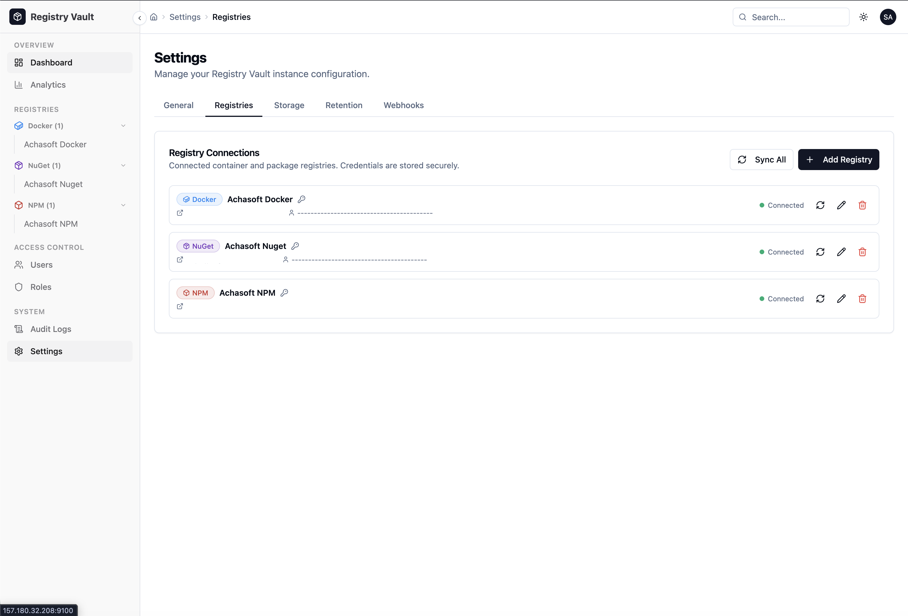
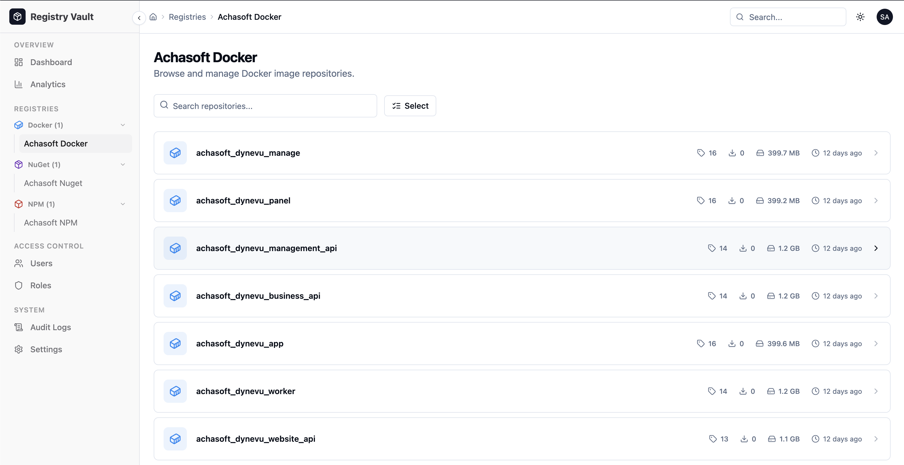
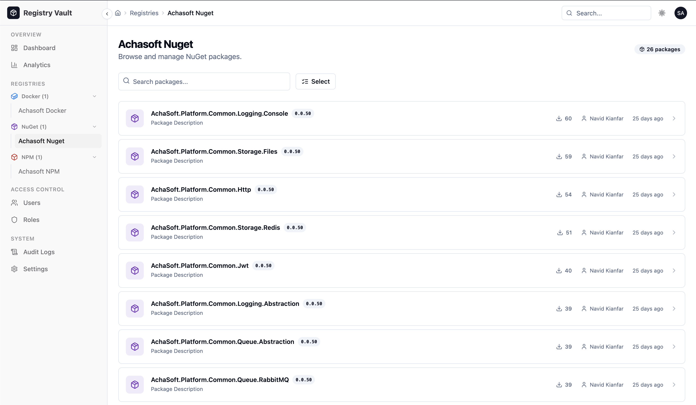

<p align="center">
  
</p>

<h1 align="center">Registry Vault</h1>

<p align="center">
  A self-hosted management panel for private Docker, NuGet, and NPM registries.<br />
  Browse, manage, and clean up images and packages from a single unified UI.
</p>

<p align="center">
  
  
  
  
  
</p>

---
Repository manager:


Docker images:


Nuget packages:


more screenshots are available in screenshots folder

## Overview

Registry Vault connects to your existing private registries and gives you a clean UI to:

- **Browse** Docker repositories, image tags, NuGet packages, and NPM modules
- **Delete** individual images/versions or bulk-clean by age or count
- **Monitor** storage usage, registry health, and pull/push activity
- **Manage** users, teams, roles, and access permissions
- **Automate** cleanup via retention policies with manual or scheduled runs
- **Audit** every action with a filterable, timestamped audit log

For a Docker registry you also run yourself, Registry Vault ships a **registry
agent**: a companion process next to CNCF Distribution that adds what the
Registry HTTP API has no endpoint for — garbage collection that actually frees
disk, storage accounting, `docker login` user management, real pull counts and
vulnerability scans. See [Choosing an image](#choosing-an-image) and
[The registry agent](#the-registry-agent).

> Registry Vault manages and removes artifacts — it does **not** push to registries.

---

## Choosing an image

Three images are published. Pick one.

| Image | Contains | Use it when |
|-------|----------|-------------|
| `kianfar/registry-vault` | Registry Vault only | You already run your registries elsewhere. Usage is unchanged from earlier versions. |
| `kianfar/registry-vault-registry` | `registry:3` + the registry agent + Trivy | You want a managed Docker registry, separate from Registry Vault — its own container, host or storage. |
| `kianfar/registry-vault-aio` | All of the above in one container | You want one container that is both the registry and its panel. It registers the embedded registry as a connection on every start. |

The last two are the same system; the all-in-one just puts it in one container.
Both listen on `:5000` for Docker clients (behind the agent's authenticating
proxy) and expose the agent's management API on `:5080`.

Example compose files live in the repository: [`docker-compose.yml`](docker-compose.yml)
(Vault only), [`docker-compose.aio.yml`](docker-compose.aio.yml) and
[`docker-compose.registry.yml`](docker-compose.registry.yml). All three read
their values from `.env` — see [`.env.example`](.env.example).

### Quick start — all-in-one

Registry Vault, a registry and the agent in one container. Three secrets are
required; the entrypoint refuses to start without them and never prints a value.

```bash
cp .env.example .env   # set AGENT_API_KEY, JWT_SECRET and ADMIN_PASSWORD
```

```bash
docker compose -f docker-compose.aio.yml up -d
```

Registry Vault is then on `http://localhost:8080` and the registry on
`localhost:5000`. Sign in to Registry Vault with the admin credentials, create a
registry user under **Registry → Registry users** (a generated password is shown
once), and log a client in with it:

```bash
docker login localhost:5000
```

The agent's management API (`:5080`) stays on loopback inside this container;
Registry Vault, in the same container, is its only client.

Generate the secrets with `openssl rand -hex 24` (`AGENT_API_KEY`, at least 16
characters) and `openssl rand -base64 48` (`JWT_SECRET`).

> **Putting a TLS terminator in front of `:5000`?** Set `AGENT_TRUSTED_PROXIES`
> to that proxy's address or CIDR (both compose files pass it through, and it
> defaults to `127.0.0.0/8,::1/128`). Without it the agent ignores the
> terminator's `X-Forwarded-Proto`, so the registry hands clients `http://`
> upload URLs, and every pull is attributed to the proxy's IP rather than the
> client's.

### Quick start — registry + agent beside Registry Vault

Two containers: the registry with its agent, and Registry Vault. Same system,
restartable and scalable apart.

```bash
cp .env.example .env   # the same three secrets
```

```bash
docker compose -f docker-compose.registry.yml up -d
```

Registry Vault registers the registry itself on every start, using
`EMBEDDED_REGISTRY_URL=http://registry:5000` and
`EMBEDDED_AGENT_URL=http://registry:5080` from the compose file — so rotating
`AGENT_API_KEY` is a single edit plus a restart. `:5080` is deliberately not
published to the host; only Registry Vault reaches it, over the compose network.

To run the registry alone, without Registry Vault:

```bash
docker run -d --name registry -p 5000:5000 -p 5080:5080 \
  -e AGENT_API_KEY="$(openssl rand -hex 24)" \
  -e AGENT_TRUSTED_PROXIES=127.0.0.0/8,::1/128 \
  -v registry-storage:/var/lib/registry \
  -v registry-agent-data:/var/lib/registry-agent \
  kianfar/registry-vault-registry
```

Both volumes matter: `/var/lib/registry` holds the images,
`/var/lib/registry-agent` holds the registry users, the event log, GC history,
maintenance state and Trivy's vulnerability database.

---

## Tech Stack

| Layer | Technology |
|-------|-----------|
| **API** | NestJS 10 + TypeORM (SQLite by default) |
| **Frontend** | React 19 + TypeScript 5.7 + Vite 6 (SWC) |
| **Styling** | Tailwind CSS 3.4 + shadcn/ui (Radix UI) |
| **State / Data** | TanStack React Query v5 |
| **Routing** | React Router v7 |
| **Charts** | Recharts 2.x |
| **Auth** | JWT (Bearer token, stored in localStorage) |
| **PWA** | vite-plugin-pwa — offline support + auto-update banner |
| **Monorepo** | pnpm workspaces |

---

## Project Structure

```
repo-station/
├── apps/
│   ├── api/                    # NestJS backend
│   │   └── src/
│   │       ├── auth/           # JWT login/logout, current user
│   │       ├── dashboard/      # Stats and activity feed
│   │       ├── docker/         # Docker repository and tag management
│   │       ├── nuget/          # NuGet package management
│   │       ├── npm/            # NPM package management
│   │       ├── rbac/           # Users, teams, roles
│   │       ├── audit-logs/     # Audit log records
│   │       ├── analytics/      # Pull/push trend data
│   │       ├── bulk/           # Bulk delete and cleanup operations
│   │       └── settings/       # Connections, credentials, policies, webhooks
│   └── web/                    # React/Vite frontend (PWA)
│       └── src/
│           ├── components/
│           │   ├── ui/         # shadcn/ui primitives
│           │   ├── layout/     # AppLayout, Sidebar, Topbar, Breadcrumbs
│           │   └── shared/     # StatCard, RegistryBadge, EmptyState, etc.
│           ├── features/
│           │   ├── dashboard/
│           │   ├── docker/
│           │   ├── nuget/
│           │   ├── npm/
│           │   ├── rbac/
│           │   ├── audit-logs/
│           │   ├── analytics/
│           │   └── settings/
│           ├── services/
│           │   ├── api-client.ts       # IApiClient interface
│           │   ├── http-api-client.ts  # Fetch-based implementation
│           │   └── queries/            # React Query hooks per feature
│           └── providers/              # Auth, Theme, Sidebar, QueryClient
└── packages/
    └── shared/                 # @registry-vault/shared (types shared by API + Web)
        └── src/
            ├── enums/          # RegistryType, Role, Permission, AuditAction, …
            ├── interfaces/     # All data models
            ├── types/          # ApiResponse<T>, PaginatedResponse<T>, filters
            └── constants/      # Registry labels, pagination defaults
```

---

## Getting Started

### Prerequisites

- **Node.js** >= 20
- **pnpm** >= 9

### Development

```bash
# Clone
git clone <repo-url>
cd repo-station

# Install dependencies
pnpm install

# Configure environment — set JWT_SECRET and ADMIN_PASSWORD (both required)
cp .env.example apps/api/.env

# Start the API (port 3001)
pnpm dev

# In a second terminal, start the frontend (port 3000)
pnpm dev:web
```

- Frontend: `http://localhost:3000`
- API: `http://localhost:3001`

The frontend proxies `/api/*` requests to the API during development.

### Initial admin account

There are no hardcoded default credentials. On first start (empty database) the API creates a single admin account from environment variables:

| Variable | Default | Description |
|----------|---------|-------------|
| `ADMIN_USERNAME` | `admin` | Username for the initial admin account |
| `ADMIN_PASSWORD` | — **required on first start** | The API refuses to start with an empty database if unset |
| `ADMIN_EMAIL` | `admin@registryvault.local` | Email for the initial admin account |

Once any user exists these variables are ignored — manage users from the UI.

```bash
docker run -e JWT_SECRET=... -e ADMIN_PASSWORD=... \
  -v registry-vault-data:/app/data -p 80:80 kianfar/registry-vault
```

### Build for Production

```bash
pnpm build
```

Frontend output: `apps/web/dist/`
API output: `apps/api/dist/`

### Docker

#### Using Docker Compose (Recommended)

The easiest way to run Registry Vault is with Docker Compose:

```bash
cp .env.example .env   # then set JWT_SECRET and ADMIN_PASSWORD
docker compose up -d
```

This uses the `docker-compose.yml` file, which stores the database in a Docker **named volume** (`registry-vault-data`) and reads configuration from `.env`. The volume is managed by Docker and survives `docker compose down` and container recreation — it is only removed if you explicitly ask for it with `docker compose down -v`.

#### Using Docker Image directly

You can run Registry Vault using the pre-built Docker image with all configuration passed inline — no `.env` file needed:

```bash
docker run -d \
  --name registry-vault \
  -p 8080:80 \
  -v registry-vault-data:/app/data \
  -e JWT_SECRET=change-me-to-a-long-random-string \
  -e ADMIN_USERNAME=admin \
  -e ADMIN_PASSWORD=choose-a-strong-password \
  kianfar/registry-vault
```

Then open `http://localhost:8080` and sign in with the admin credentials you set. Generate a strong `JWT_SECRET` with `openssl rand -base64 48`. The named volume `registry-vault-data` keeps the SQLite database and the auto-generated credential encryption key, so they survive container recreation (Docker creates the volume on first run). `ADMIN_USERNAME` / `ADMIN_PASSWORD` only matter on the very first start (empty database) — see [Configuration](#configuration) for all variables.

If you prefer a file, the same variables can come from `.env`:

```bash
docker run -d --name registry-vault -p 8080:80 -v registry-vault-data:/app/data \
  --env-file .env kianfar/registry-vault
```

#### Build locally

If you prefer to build the image yourself:

```bash
docker build -t registry-vault .
```

```bash
docker run --env-file .env -p 80:80 -v registry-vault-data:/app/data registry-vault
```

The container exposes port **80** and listens on `0.0.0.0`.

All three images are defined together in [`docker-bake.hcl`](docker-bake.hcl) —
the all-in-one reuses the registry image's runtime stage rather than rebuilding
the agent, so `agent/Dockerfile` stays the single definition of the agent, the
registry binary, Trivy and the registry config:

```bash
docker buildx bake -f docker-bake.hcl --load
```

Always pass `-f docker-bake.hcl`. With no `-f`, bake also reads the
`docker-compose*.yml` files in this directory, and those reference an `.env`
that is not in the repository — bake then fails before building anything. `TAG`
defaults to `local`, so a workstation build can never be mistaken for a release.

Configuration is supplied at run time only. No env file is copied into the image — `.dockerignore` keeps every env file (including `.env.example`) out of the build context, and because the image sets `NODE_ENV=production` the API ignores on-disk env files and reads configuration solely from the process environment. `--env-file` works because Docker reads the file on the *host* and injects the values as environment variables. Never bake secrets into an image layer.

#### Managing the data volume

The database, and the credential encryption key when it is auto-generated, live in the `registry-vault-data` volume. With Docker Compose the volume is prefixed with the project name — `registry-vault_registry-vault-data` when you run compose from a directory named `registry-vault`; run `docker volume ls` to confirm, and substitute that name below.

```bash
docker volume inspect registry-vault-data          # where Docker stores it
docker run --rm -v registry-vault-data:/data -v "$(pwd):/backup" alpine \
  tar czf /backup/registry-vault-backup.tar.gz -C /data .   # back up
docker volume rm registry-vault-data               # delete — wipes all data
```

> Removing the volume resets the instance to an empty database, so the next start re-runs the initial admin seed from `ADMIN_USERNAME` / `ADMIN_PASSWORD`.

If you are migrating from an older setup that bind-mounted `./data`, copy the existing files into the named volume before starting:

```bash
docker run --rm -v "$(pwd)/data:/from" -v registry-vault-data:/to alpine \
  sh -c "cp -a /from/. /to/"
```

---

## Configuration

The API reads environment variables at startup. [`.env.example`](.env.example) documents every variable — copy it to `.env` (Docker) or `apps/api/.env` (local development) to get started.

In Docker the `.env` file stays on the host: Docker reads it and passes the values in as environment variables. The API only loads a `.env` file from disk outside production (`NODE_ENV !== 'production'`), which is the local development path.

| Variable | Default | Description |
|----------|---------|-------------|
| `PORT` | `3001` (Docker image: `80`) | API listen port |
| `CORS_ORIGIN` | `http://localhost:3000` | Allowed CORS origin for browser requests |
| `JWT_SECRET` | — **required** | Secret for signing JWT tokens; the API refuses to start without it |
| `ADMIN_USERNAME` | `admin` | Username for the initial admin account (first start only) |
| `ADMIN_PASSWORD` | — **required on first start** | Password for the initial admin account, created when the database is empty |
| `ADMIN_EMAIL` | `admin@registryvault.local` | Email for the initial admin account (first start only) |
| `ENCRYPTION_KEY` | auto-generated | Key for encrypting stored registry credentials; auto-generated at `<data dir>/.encryption-key` when unset (set explicitly for PostgreSQL) |
| `DB_TYPE` | `sqlite` | Database backend: `sqlite` or `postgres` |
| `DB_PATH` | `./data/registry-vault.db` | SQLite database file path (when `DB_TYPE=sqlite`) |
| `DB_HOST` | `localhost` | PostgreSQL host (when `DB_TYPE=postgres`) |
| `DB_PORT` | `5432` | PostgreSQL port |
| `DB_USERNAME` | `postgres` | PostgreSQL username |
| `DB_PASSWORD` | `postgres` | PostgreSQL password |
| `DB_NAME` | `registryvault` | PostgreSQL database name |

> PostgreSQL support requires the `pg` driver, which is not installed by default:
> `pnpm --filter @registry-vault/api add pg`

### Embedded registry (the agent images only)

Plain `kianfar/registry-vault` ignores these. They matter for
`kianfar/registry-vault-aio` and for `kianfar/registry-vault` sitting next to
`kianfar/registry-vault-registry`.

| Variable | Default | Description |
|----------|---------|-------------|
| `AGENT_API_KEY` | — **required by both agent images** | Bearer key for the agent's management API *and* the password of the service principal Registry Vault authenticates with on `:5000`. At least 16 characters. |
| `EMBEDDED_REGISTRY_URL` | unset | Registry URL to register as a connection on every start. Unset, Registry Vault creates no connection of its own. The all-in-one image sets `http://127.0.0.1:5000`. |
| `EMBEDDED_AGENT_URL` | `http://127.0.0.1:5080` | Management API of the agent in front of that registry. |
| `AGENT_SERVICE_USER` | `registry-vault` | Username Registry Vault authenticates with on `:5000`. Must match the agent's own `AGENT_SERVICE_USER`. |

Registry Vault re-registers that connection on every start, so rotating
`AGENT_API_KEY` on both sides and restarting is all a key rotation takes.

---

## The registry agent

The agent (`agent/`, Go) runs beside a `registry:3` container, supervises it and
fronts it as an authenticating, streaming reverse proxy. The registry itself
listens only on `127.0.0.1:5001` with no auth of its own.

```
        :5000 (Docker clients)            :5080 (management API)
              │                                    │
    ┌─────────▼────────────────────────────────────▼─────────┐
    │                    registry-agent                       │
    │  auth gate · write gate · event log · supervisor · API  │
    └─────────┬────────────────────────────────────┬─────────┘
              │ reverse proxy                       │ exec
      127.0.0.1:5001                    registry garbage-collect, trivy image …
```

What it adds over a bare registry:

- **Garbage collection** that frees disk — see [Reclaiming disk space](#reclaiming-disk-space).
- **Disk and storage accounting**: per-repository exclusive and shared bytes, and a low-disk warning.
- **Repository directory removal**, so a repository emptied of tags stops being listed.
- **Stale upload purging** for pushes that were interrupted.
- **Read-only maintenance mode**, which survives a restart.
- **Health, logs and a registry restart** endpoint.
- **Registry user management**: the `docker login` accounts, with `pull` / `push` / `admin` roles.
- **Pull and push events**, which give Registry Vault real pull statistics and near-instant sync.
- **Trivy vulnerability scans** of a tag, on request. A result names the
  platform that was actually scanned, read from the image's own config; asking
  for a platform the image does not have fails the scan rather than relabelling
  it. Scans run one at a time — the database is downloaded on first use, which
  needs internet access.

### Agent configuration

Everything is an environment variable. Only `AGENT_API_KEY` has no default: the
agent exits with a clear message when it is missing or shorter than 16
characters, and the key is never logged. The full table is in
[agent/README.md](agent/README.md); the contract Registry Vault speaks is
[agent/API.md](agent/API.md). The ones worth knowing:

| Variable | Default | Meaning |
|----------|---------|---------|
| `AGENT_API_KEY` | — **required** | Bearer key for `:5080`, and the service principal's password on `:5000`. |
| `AGENT_LISTEN` | `:5000` | Public registry address (the proxy). |
| `AGENT_API_LISTEN` | `:5080` | Management API address. The all-in-one image binds it to loopback. |
| `AGENT_DATA_DIR` | `/var/lib/registry-agent` | Users, event log, GC history, maintenance state, scan results, Trivy cache. **Mount a volume.** |
| `REGISTRY_AUTH` | `htpasswd` | `htpasswd` authenticates every `:5000` request against the agent's user store. `none` allows anonymous pull and push — only for a registry not reachable from outside. |
| `REGISTRY_HTPASSWD_IMPORT` | unset | Path of an existing htpasswd file. Bcrypt entries not yet in the store are imported on start with role `push`. |
| `AGENT_SERVICE_USER` | `registry-vault` | The service principal's username; with `AGENT_API_KEY` as its password it is `admin` on `:5000`. Its traffic is recorded as `registry-vault` so Vault can ignore its own sync. |
| `AGENT_TRUSTED_PROXIES` | `127.0.0.0/8,::1/128` | Comma-separated CIDR blocks or bare addresses of the proxies in front of the agent. Their `X-Forwarded-For` / `X-Forwarded-Proto` are believed; everyone else's are replaced with what the agent sees. **Terminating TLS in front of `:5000` means listing the terminator here** — see below. An empty value trusts nobody; an unparseable one logs a warning and falls back to loopback. |
| `AGENT_EVENT_RETENTION_DAYS` | `30` | Events older than this are pruned. |
| `TRIVY_ENABLED` | `true` when `trivy` is on `PATH` | Vulnerability scanning on or off. |

Anything else in the environment is passed through to the registry child, so
`REGISTRY_STORAGE_FILESYSTEM_ROOTDIRECTORY` and friends still work. The child
always runs with `REGISTRY_STORAGE_DELETE_ENABLED=true`, because every
management operation depends on deletes.

> **Behind a TLS terminator, set `AGENT_TRUSTED_PROXIES`.** A forwarded header
> is only believed when the direct peer is one of the listed addresses, and by
> default that is loopback alone. With nginx, Traefik or a load balancer in
> front of `:5000` and the terminator not listed, `X-Forwarded-Proto` is
> ignored — the registry hands clients `http://` upload URLs, and every pull is
> recorded against the proxy's address instead of the client's.

### Registry users

`docker login` accounts are the agent's, not Registry Vault's — separate rosters
with separate roles. Manage them under **Registry → Registry users** (admins
only); a generated password is shown once, at creation or reset.

| Agent role | May do on `:5000` |
|------------|-------------------|
| `pull` | `GET` and `HEAD` under `/v2/` |
| `push` | `pull`, plus `POST`, `PUT`, `PATCH` |
| `admin` | `push`, plus `DELETE` and `GET /v2/_catalog` |

Passwords are bcrypt (cost 10); a successful verification is cached for 60
seconds so a pull with hundreds of requests pays bcrypt once. Changing or
deleting a user clears that cache immediately.

---

## Reclaiming disk space

Deleting a tag does not free disk. The Registry V2 API deletes by digest and
only *untags* content; the bytes stay until the registry's garbage collector
runs. Two facts make this worse than it sounds for multi-arch images:

- Deleting a multi-arch image's index and then running a plain
  `registry garbage-collect` frees **nothing** — the index is gone, but its
  platform manifests are still referenced.
- On `registry:2`, `garbage-collect --delete-untagged` **destroys still-tagged
  multi-arch images**: every platform manifest 404s afterwards.
- On `registry:3`, `--delete-untagged` frees exactly the deleted image and
  leaves the kept ones intact.

So the agent always passes `--delete-untagged`, and **refuses to collect** when
`registry --version` reports a major version below 3. That is why the registry
images are built on `registry:3`.

With an agent configured, garbage collection is in the UI under
**Registry → Maintenance**:

- **Dry run first.** It reports what would go without touching anything.
- **A real run closes the write gate**: pushes get `503` with a `Retry-After`
  while it works. Reads are never gated. It waits up to 60 s for in-flight
  writes, runs the collector, removes repository directories left with no tags
  and no manifests, then reopens the gate — always, including on failure.
- **Only one collection runs at a time**, and the last 20 jobs are kept with
  before/after sizes and freed bytes.
- **Schedule it** per connection: daily or weekly, at an hour you choose. A
  retention policy can also run a collection afterwards on every registry it
  deleted from.

Without an agent, run the collector yourself on the registry host:

```bash
registry garbage-collect --delete-untagged=true /etc/docker/registry/config.yml
```

Deleting also requires a registry that permits it
(`REGISTRY_STORAGE_DELETE_ENABLED=true`) and credentials with delete rights;
when either is missing the delete is reported as failed and the local record is
kept rather than silently hidden.

---

## Roles & permissions

Registry Vault enforces roles server-side, and the default is deny: any request
that is not a `GET` or `HEAD` requires an administrator unless the route says
otherwise. A write route added later is closed until someone opens it.

| Capability | Admin | Maintainer | Reader |
|------------|:-----:|:----------:|:------:|
| Browse repositories, packages, tags, versions, analytics, audit logs | ✅ | ✅ | ✅ |
| Delete a Docker tag; bulk-delete tags and versions | ✅ | ✅ | — |
| Request a vulnerability scan | ✅ | ✅ | — |
| Run garbage collection; purge stale uploads | ✅ | ✅ | — |
| Delete a whole repository or package | ✅ | — | — |
| Cleanup by count/age, registry repair, manual sync | ✅ | — | — |
| Settings: registries, credentials, retention, webhooks | ✅ | — | — |
| Users and teams | ✅ | — | — |
| Agent admin: maintenance mode, registry restart, registry users, agent settings, agent logs, repository directory removal | ✅ | — | — |

A mixed bulk delete is checked in full before anything is deleted, so a
maintainer's request that also names a whole repository is refused outright
rather than half-applied.

Two more rules:

- **Roles and deactivation take effect immediately.** The caller is resolved
  from the database on every request, not from the token, so a demotion or a
  deactivation bites at once instead of when a 24-hour token expires.
- **Changing your own password requires the current one**; only an administrator
  can reset someone else's without it. The last administrator who can still sign
  in cannot be demoted, deactivated or deleted.

---

## Features

### Registry Management
- Add registry connections with custom endpoints (Docker, NuGet, NPM)
- Browse repositories and packages per registry
- View detailed tag / version metadata
- Attach a registry agent to a Docker connection for maintenance, pull statistics and scans

### Cleanup & Retention
- **Bulk delete** selected tags or package versions, or whole repositories/packages
- **Cleanup**: keep N latest versions or delete versions older than N days
- **Retention policies**: define rules per registry type, enable/disable, run on demand
- **Retention by pulls** (Docker, needs an agent): delete tags nobody pulled for N days
- **Run GC after** a retention run, on every registry it deleted from
- **Repair**: scan a Docker registry for half-deleted tags and finish removing them

Every one of these deletes on the registry itself, not only in Registry Vault's
mirror. A run reports what failed rather than counting it as cleaned.

#### Retention by "not pulled for N days"

Pull history comes from the agent's event log, so this criterion is honest
about what it cannot know, and a repository is **skipped** rather than judged
when:

- its registry has no agent, or
- the agent is not online, or Registry Vault has not reached it for more than
  15 minutes — "nobody pulled it" and "nobody could tell us" look identical in
  the database, and only one is a reason to delete.

A gap in the event log (the agent pruned events before Vault read them) does not
disable the criterion forever: the gap becomes the new start of the observable
window, so the policy applies again once N days have passed since it with the
feed intact. The same goes for the moment the agent was first configured — a tag
pushed before pull tracking began is never deleted on the strength of a pull
that could not have been seen.

Criteria are combined with AND: adding "not pulled for N days" to a policy can
only ever delete less, never more. A policy that sets none of keep-last-N,
older-than and not-pulled-for is refused rather than selecting everything.

### Multi-arch images
A tag that was built for several platforms points at an OCI index rather than a
single image. Registry Vault lists every platform under the tag (attestation
entries from `docker buildx` are not shown), and the tag's digest is the index
digest — the one `docker pull` resolves.

### How Docker deletion works
The Registry V2 API deletes by digest, not by tag name, so Registry Vault
deletes the digest a tag resolves to — never the platform manifests inside it.
Two consequences are worth knowing:

- **Tags sharing a digest go together.** `latest` and the version tag built from
  the same image are one manifest; deleting either removes both. The API
  reports every tag that went with it.
- **Disk space is reclaimed separately.** Deleting a manifest untags content;
  the registry frees it during garbage collection — see
  [Reclaiming disk space](#reclaiming-disk-space). Until then the repository
  name can linger in `/v2/_catalog` with no tags. Registry Vault does not mirror
  tagless repositories, so they disappear from the UI on the next sync, and a
  repository removed on the registry host is pruned from Vault on sync too.

Deleting requires a registry that permits it (`REGISTRY_STORAGE_DELETE_ENABLED=true`)
and credentials with delete rights; when either is missing the delete is
reported as failed and the local record is kept rather than silently hidden.

#### Repairing half-deleted tags

A tag whose platform manifests were deleted while the tag itself survived stays
listed but cannot be pulled (`manifest unknown`). Settings → Registries →
**Scan for half-deleted tags** finds these and, on confirmation, removes them.

The same scan runs from the CLI without the app:

```bash
node scripts/registry-repair.mjs --url https://registry.example.com --username USER --password PASS
```

Add `--apply` to delete what it finds, and `--repo PREFIX` to limit the scope.

### User & Access Management
- Create, edit, deactivate, and delete users
- Changing your own password requires the current one; an administrator resets someone else's without it
- The last administrator who can still sign in cannot be demoted, deactivated or deleted
- Teams with member management (API only in this release — no UI route is registered)
- Role-based permissions, enforced server-side — see [Roles & permissions](#roles--permissions)
- Registry (`docker login`) users on an agent-backed registry, managed separately

### Settings
| Tab | Functionality |
|-----|--------------|
| General | Instance name (shown in sidebar), self-registration toggle, maintenance mode banner |
| Registries | Add / edit / delete registry connections, their credentials, and their agent (URL + key, "Test agent") |
| Storage | Storage backend in use and the supported options |
| Retention | Create / edit / delete policies, toggle enable, run immediately |
| Webhooks | Add / edit / delete webhooks with event and registry filters |

### Per-registry pages (Docker with an agent)

| Page | Shows |
|------|-------|
| Registry → Maintenance | Health, disk and per-repository storage, garbage collection (dry run, run, history, schedule), stale uploads, read-only mode, agent logs, registry restart, agent settings |
| Registry → Registry users | The `docker login` accounts on that registry, with their roles |

Tags carry pull counts and a vulnerability summary once an agent is configured;
the dashboard shows a low-disk banner for any registry past its warning
threshold (default 85% used, per connection).

#### Configuring the agent on a connection

In **Settings → Registries**, a Docker connection takes the agent's management
URL and key. The key is write-only: it is encrypted at rest, never returned and
never logged. **Changing the URL requires entering the key again** in the same
save — Registry Vault will not send a stored key to a new address. "Test agent"
probes it before you save.

### PWA
The frontend is a Progressive Web App — installable, works offline with cached assets, and shows an update banner when a new version is deployed.

---

## API Endpoints

All endpoints are prefixed with `/api`.

| Method | Path | Description |
|--------|------|-------------|
| POST | `/auth/login` | Authenticate and receive JWT |
| GET | `/auth/me` | Current user profile |
| GET | `/dashboard/stats` | Aggregated stats |
| GET | `/dashboard/activity` | Recent activity feed |
| GET | `/docker/repositories`, `/docker/repositories/:id`, `/docker/repositories/:id/tags` | Docker repositories and tags |
| GET/DELETE | `/docker/repositories/:id/tags/:tag` | Tag detail; delete a tag (Maintainer) |
| GET | `/nuget/packages`, `/npm/packages` | NuGet / NPM packages and versions |
| GET/POST/PATCH/DELETE | `/users` | User CRUD |
| PATCH | `/users/:id/password` | Change your own (current password required) or reset another's (Admin) |
| GET | `/teams`, `/teams/:id` | Teams |
| GET | `/audit-logs` | Filterable audit log |
| GET | `/analytics/summary` | Pull/push trend data |
| GET/POST/PATCH/DELETE | `/settings/registries` | Registry connection CRUD |
| POST | `/settings/registries/agent/test`, `/settings/registries/:id/agent/test` | Probe an agent |
| POST | `/settings/registries/:id/sync`, `/settings/sync` | Sync one registry or all |
| GET/POST/PATCH/DELETE | `/settings/retention` | Retention policy CRUD |
| POST | `/settings/retention/:id/run` | Run policy immediately |
| GET/POST/PATCH/DELETE | `/settings/webhooks` | Webhook CRUD |
| GET/POST/PATCH/DELETE | `/credentials` | Registry credential CRUD (secrets are never returned) |
| POST | `/bulk/delete` | Bulk delete items (whole repositories are Admin-only) |
| POST | `/bulk/cleanup` | Cleanup versions by count, age or pulls |
| POST | `/bulk/repair` | Scan (and with `apply: true`, remove) half-deleted Docker tags |

Registry agent routes, all under `/registries/:connectionId/agent` unless noted:

| Method | Path | Description |
|--------|------|-------------|
| GET | `/registries/agents/overview` | Every connection's agent, for the dashboard |
| GET | `…/health`, `…/storage`, `…/logs` | Health and disk, storage accounting, process logs |
| POST | `…/gc` | Start a garbage collection (`dryRun` supported) |
| POST | `…/repositories/remove` | Remove a repository directory from storage |
| GET/POST | `…/uploads`, `…/uploads/purge` | Stale uploads, and purging them |
| GET/PUT | `…/maintenance` | Read-only maintenance mode |
| POST | `…/registry/restart` | Restart the registry process |
| GET/POST/PATCH/DELETE | `…/users` | Registry (`docker login`) users |
| GET/PUT | `…/settings` | Low-disk threshold, GC schedule, auto-scan on push |
| GET | `/docker/repositories/:id/pulls` | Pull statistics for a repository |
| GET/POST | `/docker/repositories/:id/tags/:tag/scan` | Latest scan; queue a new one |

---

## Pages

| Page | Route |
|------|-------|
| Dashboard | `/` |
| Docker Repositories | `/docker` |
| Docker Repository Detail | `/docker/:repositoryId`, `/registry/:connectionId/docker/:repositoryId` |
| Docker Tag Detail | `/docker/:repositoryId/tags/:tagName` |
| NuGet Packages / Package / Version | `/nuget`, `/nuget/:packageId`, `/nuget/:packageId/versions/:version` |
| NPM Packages / Package / Version | `/npm`, `/npm/:packageName`, `/npm/:packageName/versions/:version` |
| Registry (one connection) | `/registry/:connectionId` |
| Registry Maintenance | `/registry/:connectionId/maintenance` |
| Registry Users | `/registry/:connectionId/users` |
| Users | `/access/users` |
| User Detail | `/access/users/:userId` |
| Roles | `/access/roles` |
| Audit Logs | `/audit-logs` |
| Analytics | `/analytics` |
| Settings | `/settings/general`, `/settings/registries`, `/settings/storage`, `/settings/retention`, `/settings/webhooks` |

---

## Upgrade notes

Read these before moving an existing installation to 1.1.0.

**Running `kianfar/registry-vault` on its own?** Nothing changes except the
permission model below. The image, its variables and its volume are the same.

**Moving an existing `registry:2` to the agent images.** The on-disk layout is
the same, so point the new container at the existing storage volume
(`/var/lib/registry`) and it serves the same images. Verify a pull of something
you care about before decommissioning the old container; if anything looks off,
re-push from CI rather than repairing by hand. Add a second volume for
`/var/lib/registry-agent` — without it the registry users, the event log and GC
history are lost on every recreate.

**Keeping your existing logins.** Point `REGISTRY_HTPASSWD_IMPORT` at the old
htpasswd file. On start, users not yet in the agent's store are imported with
role `push`. Only bcrypt entries can be imported — anything else has to be
recreated. Afterwards the accounts are the agent's: `docker login` credentials
are created, changed and deleted through Registry Vault or the agent's API, not
by editing a file.

**Connecting Registry Vault to an agent registry.** In **Settings → Registries**,
set the connection's agent URL and key (the agent's `AGENT_API_KEY`). Until
that is done, everything agent-backed — maintenance, GC, pull statistics,
scans, retention by pulls — is simply absent for that registry. The all-in-one
and the two-container compose files do this for you on every start.

**Credentials for an agent registry.** When the agent runs with
`REGISTRY_AUTH=none`, Registry Vault must still authenticate as the service
principal to delete and list the catalog: username `AGENT_SERVICE_USER`
(default `registry-vault`), password `AGENT_API_KEY`. Anonymous callers get
`push` and nothing more.

**Behind a TLS terminator, set `AGENT_TRUSTED_PROXIES`** to the terminator's
address or CIDR. This is new, and the default trusts loopback only.

**Readers lose write access they previously had.** Roles are now enforced on
the server for every request, with writes denied by default. If a workflow
depended on a Reader deleting tags or running cleanup, move that account to
Maintainer (tags and versions, scans, GC, upload purging) or Admin. Demotions
and deactivations also take effect on the next request instead of when the
token expires.

---

## Known limits

- **`docker stop` during a long garbage collection.** On SIGTERM the agent waits
  for a running collection to finish, which can exceed Docker's 10-second
  default before it sends SIGKILL. Give the container a longer grace period —
  `docker run --stop-timeout 600`, or `stop_grace_period` in compose — or stop
  it when no collection is running.
- **The agent's event log is capped**: the most recent 50,000 events, and
  nothing older than `AGENT_EVENT_RETENTION_DAYS` (30 by default) — whichever
  bites first, in memory and on disk alike. When Registry Vault
  falls behind that, the agent reports a gap, pull statistics for that registry
  are marked incomplete, and retention by pulls restarts its observation window
  from the gap.
- **The all-in-one image will not start without `ADMIN_PASSWORD`**, alongside
  `AGENT_API_KEY` and `JWT_SECRET` — on every start, not only the first. The
  entrypoint names what is missing and never prints a value.

---

## License

MIT — see [LICENSE](LICENSE) for details.
